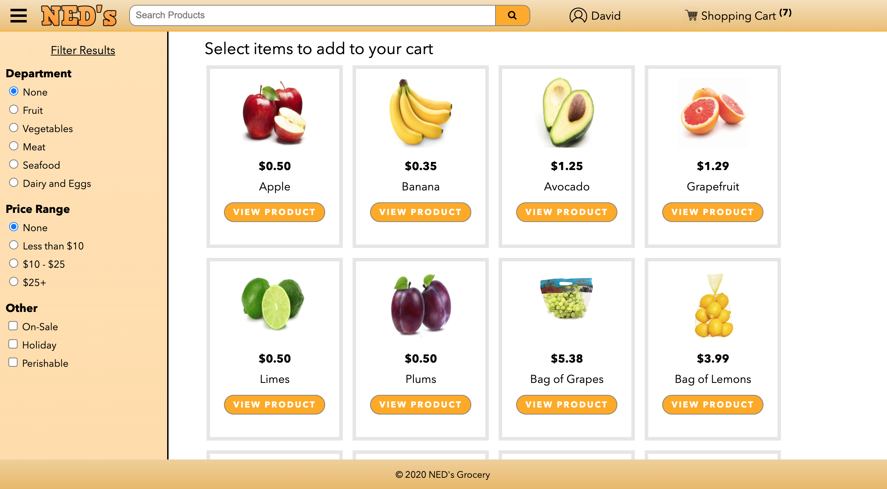

# NED's Grocery Ecommerce Application

Grocery store ecommerce web application developed with PHP, HTML, CSS, and vanilla JavaScript. Utilizes a MySQL database to manage individual user entities and products. A user may filter his/her search with a specification of department, price range, and other categories - or a combination between them. Aimed to provide a simple, but engaging, UI and design to allow shoppers to navigate with ease. Emphasizes account security with a strong password encryption algorithm. Final project for CSCI 4300 at UGA.

