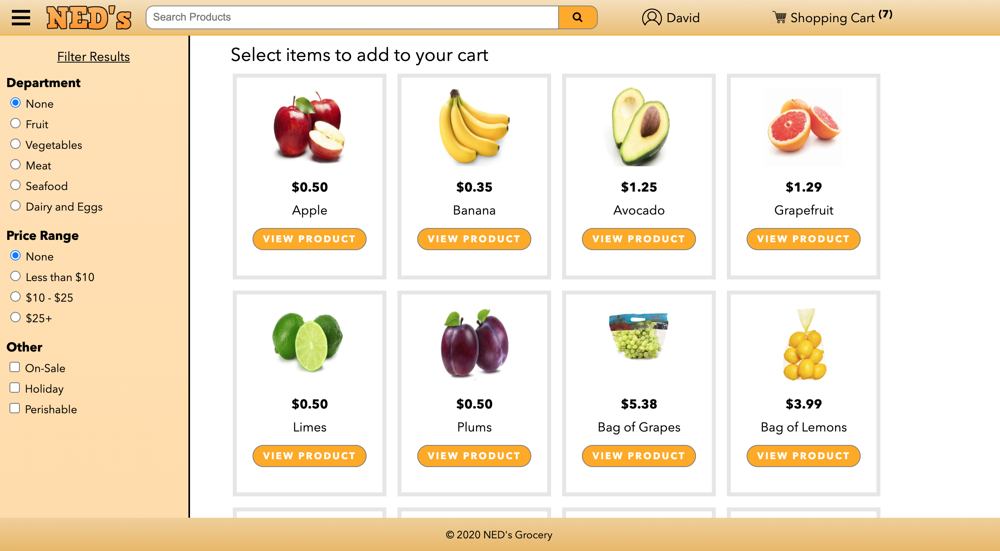

# GroceryEcommerce

Grocery store ecommerce web application developed with HTML, CSS, JavaScript, and PHP. Utilizes a local MySQL database to manage individual user entities and products. Final project for CSCI 4300 at UGA.

